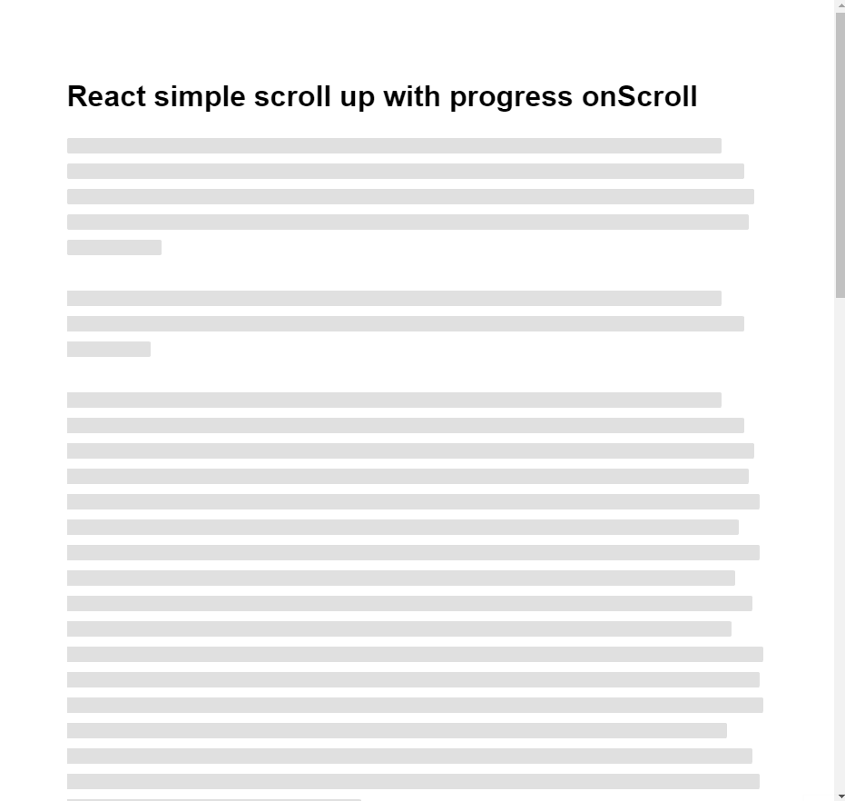

# React Simple Scroll up (back to top)

> A minimal lightweight react component for adding a nice scroll up (back to top) with onScroll progress.

[](https://www.npmjs.com/package/react-simple-scroll-up) [](https://standardjs.com)

<p align="center">
  
</p>

## Install

#### npm

```sh
npm i react-simple-scroll-up
```

#### Yarn

```sh
yarn add react-simple-scroll-up
```

---

### Examples

```jsx
import React from 'react'
import { ScrollToTop } from 'react-simple-scroll-up'

const MyComponent = () => {
  return (
    <div className='App'>
      <ScrollToTop {/* Props */} />
    </div>
  )
}
```

<br />

## Props

| Prop               | Type                | Options  | Description                                                                                                                        | Default                  |
| ------------------ |:-------------------:| -------- | ---------------------------------------------------------------------------------------------------------------------------------- |:------------------------:|
| `size`             | number              | Optional | Set button width and height (in pixels)                                                                                            | `50`                     |
| `offsetTop`        | number              | Optional | Show button after number of pixels that document has scrolled vertically                                                           | `100`                    |
| `bgColor`          | string              | Optional | Button background color                                                                                                            | `rgb(0 0 0 / 75%)`       |
| `strokeWidth`      | number              | Optional | Scroll progess bar width (in pixels)                                                                                               | `4`                      |
| `strokeFillColor`  | string              | Optional | Scroll progess bar fill color                                                                                                      | `rgb(0 0 0 / 50%)`       |
| `strokeEmptyColor` | string              | Optional | Scroll progess bar empty color                                                                                                     | `rgb(200 200 200 / 85%)` |
| `symbol`           | string or ReactNode | Optional | Use any HTML [Symbols](https://unicode-table.com/en/2B99/) by simply _copy/paste_ it OR any custom element, e.g. `FontAwesomeIcon` | `🡩`                     |
| `symbolSize`       | number              | Optional | Symbol font size (in pixels). Only applies when `symbol` is a string.                                                              | `20`                     |
| `symbolColor`      | string              | Optional | Symbol color.                                                                                                                      | `#fff`                   |
| `onScrolling`      | function            | Optional | Callback `function` that is triggered while scrolling with `value` passed                                                          | `-`                      |
| `onScrollEnd`      | function            | Optional | Callback `function` that is triggered when scroll is ended                                                                         | `-`                      |
| `className`        | string              | Optional | CSS class name                                                                                                                     | `to-top-progress`        |
| `style`            | React.CSSProperties | Optional | CSS style                                                                                                                          | `-`                      |

<br />

[](https://codesandbox.io/s/react-simple-scroll-up-with-progress-onscroll-dxobe?fontsize=14&hidenavigation=1&theme=dark)

### License

MIT © [awran5](https://github.com/awran5/)
